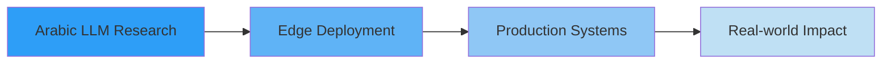

# 👋 Hi, I'm Sahir Azeddin

<div align="center">
  
[](https://git.io/typing-svg)

[](https://linkedin.com/in/azeddin-sahir)
[](mailto:azdinsahir11@gmail.com)
[](https://huggingface.co/azeddinshr)

</div>

---

## 🚀 About Me

Applied AI Engineer specializing in **Large Language Models**, **RAG Systems**, **Vision-Language Models**, and **Agentic AI**. I focus on building production-ready ML solutions with emphasis on Arabic NLP and edge deployment.

```python
class AIEngineer:
    def __init__(self):
        self.name = "Sahir Azeddin"
        self.role = "Applied AI/ML Engineer"
        self.location = "Morocco 🇲🇦"
        self.languages = ["English", "Arabic", "French", "Darija"]
        
    def current_focus(self):
        return [
            "🤖 Fine-tuning LLMs for Arabic",
            "🔍 Building RAG systems",
            "👁️ Vision-Language Models",
            "🎯 Multi-agent architectures",
            "📱 Edge AI deployment"
        ]
    
    def expertise(self):
        return {
            "LLMs": ["Fine-tuning", "LoRA/AdaLoRA", "Quantization", "Prompt Engineering"],
            "Frameworks": ["PyTorch", "Transformers", "LangChain", "LangGraph"],
            "Deployment": ["Docker", "FastAPI", "Azure", "Model Serving"],
            "Specialization": ["Arabic NLP", "Multimodal AI", "Agentic Systems"]
        }
```

---

## 💼 Professional Experience

### 🌦️ **Direction Générale de la Météorologie (DGM)** - Morocco
**AI Research Engineer Intern** | *Mar 2025 - Sep 2025*

- 🛰️ Built **1,000+ satellite image dataset** with LLM validation for meteorological AI
- 🎯 Fine-tuned **LLaVA-OneVision** and **Qwen2-VL** for satellite image interpretation
- 🤝 Architected **multi-agent system** reducing analysis time by **60%**
- ⚡ Optimized inference pipeline for real-time weather forecasting

### 🏢 **Projstream** - USA (Remote)
**Machine Learning Engineer** | *Jan 2025 - May 2025*

- 🎨 Built **no-code ML platform** for enterprise analytics
- 📊 Achieved **94% forecasting accuracy** with automated pipelines
- 💬 Developed **LLM-powered analytics** interface for natural language queries
- 📈 Delivered interactive dashboards for risk analysis and decision-making

---

## 🔬 Featured Projects

### 🌟 **LFM2-1.2B-RAG Arabic QA System**
[](https://huggingface.co/azeddinshr)

Edge-optimized Arabic language model fine-tuned with AdaLoRA

- ✨ Outperforms models **10-15x larger** on Arabic benchmarks
- ⚡ **2x faster inference** on 10K Arabic QA pairs
- 📱 Suitable for **mobile/CPU deployment**
- 🎯 Score: **5.39/10** on Arabic Benchmark

**Tech Stack:** `LiquidAI` • `AdaLoRA` • `PyTorch` • `Transformers`

---

### 🏡 **Real Estate AI Assistant**
Automated property matching with 24/7 operation

- 🤖 Built with **n8n** + **GPT-4** filtering
- ⚡ **85% reduction** in response time
- 📊 **100+ weekly inquiries** handled
- 😊 **92% satisfaction** rate

**Tech Stack:** `n8n` • `OpenAI GPT-4` • `Automation`

---

## 🛠️ Tech Stack

### 🤖 AI/ML & LLMs


### 💾 Data & Databases


### 🚀 Deployment & MLOps


### 🔧 Automation & Tools


---

## 📊 GitHub Stats

<div align="center">
  


</div>

---

## 🎓 Education

**🎓 Master of Science in Artificial Intelligence and Data Science**  
Mohammed V University, Rabat, Morocco | *Expected Sep 2025*

**🎓 Bachelor of Science in Big Data and Artificial Intelligence**  
Mohammed V University, Rabat, Morocco | *Jun 2023*

---

## 🌟 Specializations

<table>
<tr>
<td width="50%">

### 🔤 Arabic NLP
- Fine-tuning Arabic LLMs
- RAG for Arabic content
- Dialect processing (Darija)
- Cross-lingual models

</td>
<td width="50%">

### 🤖 Agentic AI
- Multi-agent architectures
- LangChain/LangGraph
- Autonomous systems
- Tool-augmented LLMs

</td>
</tr>
<tr>
<td width="50%">

### 👁️ Vision-Language Models
- Multimodal LLMs
- LLaVA, Qwen2-VL
- Satellite image analysis
- Image-to-text generation

</td>
<td width="50%">

### 📱 Edge AI
- Model quantization
- On-device deployment
- Inference optimization
- Mobile ML pipelines

</td>
</tr>
</table>

---

## 🏆 Achievements & Impact

- 🎯 **60% reduction** in meteorological analysis time through multi-agent systems
- 🚀 **2x faster inference** with edge-optimized Arabic QA model
- 📊 **94% forecasting accuracy** in ML cost estimation platform
- ⚡ **85% faster** automated property matching response time
- 🌍 Published models serving **Arabic-speaking** communities

---

## 📈 What I'm Working On



- 🔬 **Research**: Advanced Arabic NLP models
- 🏗️ **Building**: Production-ready RAG systems
- 📚 **Learning**: Latest in multimodal AI & agents
- 🤝 **Collaborating**: Open-source AI projects

---

## 💡 Let's Connect!

I'm always interested in collaborating on:
- 🤝 Arabic NLP projects
- 🔬 AI research initiatives
- 🛠️ Production ML systems
- 🌍 Open-source contributions

**📫 Reach out:**
- 💼 [LinkedIn](https://linkedin.com/in/azeddin-sahir)
- 📧 [Email](mailto:azdinsahir11@gmail.com)
- 🤗 [HuggingFace](https://huggingface.co/azeddinshr)

---

<div align="center">

### 💬 *"Building AI systems that understand and serve Arabic-speaking communities"*


**⭐ Star my repos if you find them useful!**

</div>

---

<div align="center">
  
</div>
